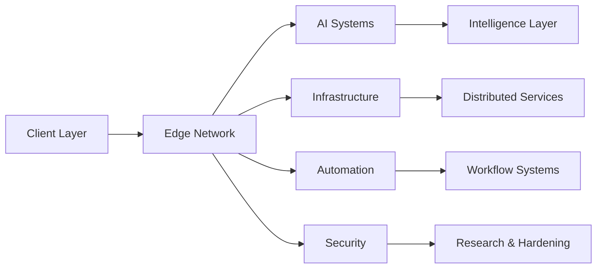

<div align="center">


<br>

<p align="center">
  
  
  
  
</p>

</div>

---

<br>

```txt
Hazaire is a technology organization focused on building intelligent
infrastructure, scalable AI systems, and security-oriented platforms.

The organization operates at the intersection of distributed systems,
automation, cloud architecture, and experimental engineering.
```

<br>

---

# Manifest

```txt
Build systems that scale.
Automate repetitive infrastructure.
Prioritize reliability over complexity.
Design technology that remains invisible.
Engineer for long-term resilience.
```

---

# Infrastructure Overview



---

# Operating Principles

| Principle | Description |
|---|---|
| `01` | Build for scale |
| `02` | Secure infrastructure by default |
| `03` | Reduce operational complexity |
| `04` | Automate repetitive systems |
| `05` | Maintain long-term adaptability |

---

# Technology

<div align="center">

```txt
React • Next.js • Node.js • Python • Docker • Linux
PostgreSQL • MongoDB • Cloudflare • TailwindCSS
```

</div>

---

# Active Domains

| Domain | Description |
|---|---|
| `AI Systems` | Intelligent processing and automation |
| `Infrastructure` | Distributed architecture and deployment |
| `Security` | Hardening, resilience, and research |
| `Research` | Experimental systems and engineering |
| `Tooling` | Internal and developer-focused utilities |

---

# System Status

```txt
SYSTEM STATUS        OPERATIONAL
EDGE NETWORK         ACTIVE
AI MODULES           ONLINE
AUTOMATION LAYER     STABLE
SECURITY LAYER       ACTIVE
RESEARCH SYSTEMS     RUNNING
```

---

# Current Focus

```txt
• intelligent cloud infrastructure
• scalable distributed systems
• AI-integrated automation
• resilient security architecture
• experimental digital platforms
```

---

# Repositories

| Repository | Role |
|---|---|
| `hazaire-core` | Primary infrastructure |
| `hazaire-ai` | AI systems and automation |
| `hazaire-cloud` | Distributed infrastructure |
| `hazaire-sec` | Security engineering |
| `hazaire-labs` | Experimental research |

---

# Connect

<div align="center">

<a href="https://hazaire-website.info-hazaire.workers.dev/">
  
</a>

<a href="https://github.com/hazaire">
  
</a>

</div>

---

<div align="center">
<br>
</div>
